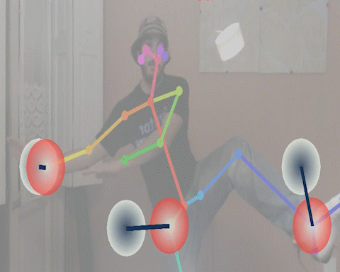

# TwisterPose!

A game like twister, but with the screen as a the board.

Simple game using OpenPose, OpenCv and PyGame.

    

## Game
The game is played with a camera and the player standing up facing the screen. With OpenPose, the player's body keypoints such as his nose, shoulders, elbows and toes are detected and displayed at the screen at real time.

A board is shown in screen, and on each challenge a random selection of cells are marked as a target. The player has limited time to try to adjust his body to this targets, so as the keypoints detections of his body make the best fit, getting more points the closer to the marked target they are.

## Set up
### Prerequisites
* [OpenPose](https://github.com/CMU-Perceptual-Computing-Lab/openpose) - For body detection.
* OpenCv
* Mongo - Game scores and player names are stored on a database and the ranking is shown at the end of every game.
* PyMongo
* PyGame
* Numpy, ConfigParser, etc.

### Configuration

- **Constants.py**: Game hard constants such as width and height, challenge duration, etc.
- **config.ini**: Environment dependent configuration such as OpenPose folder and Mongo connection data.

### System design
Code is heavy based on [DanceCV](https://github.com/stbnps/DanceCV/), the font and resources are taken from there.

The sequence of game state and screens transitions is managed thanks to the code provided in [this useful gist](https://gist.github.com/iminurnamez/8d51f5b40032f106a847 )

Gradients are drawn thanks to [proyect gradients](https://www.pygame.org/project-gradients-307-491.html)

The webcam image processing is done on Input.py, the main game core functions are defined at the GameBrain.py, and each scene has its own class file.

## About
Game was created to be shown at Ingeniería Demuestra 2018, a tech diffusion expo organized by the Engineering University at Montevideo, Uruguay. The main target audience of this expo is curious people and kids, so we thought this game was a good way to catch that public attention and show them how OpenPose works and the way we are using it on our thesis. 

It worked quite good and the game was played by more than a hundred people.

* **Santiago Gómez** - sgomezsiri [at] gmail.com
* **Marcelo Ortega** - marcetega [at] gmail.com
